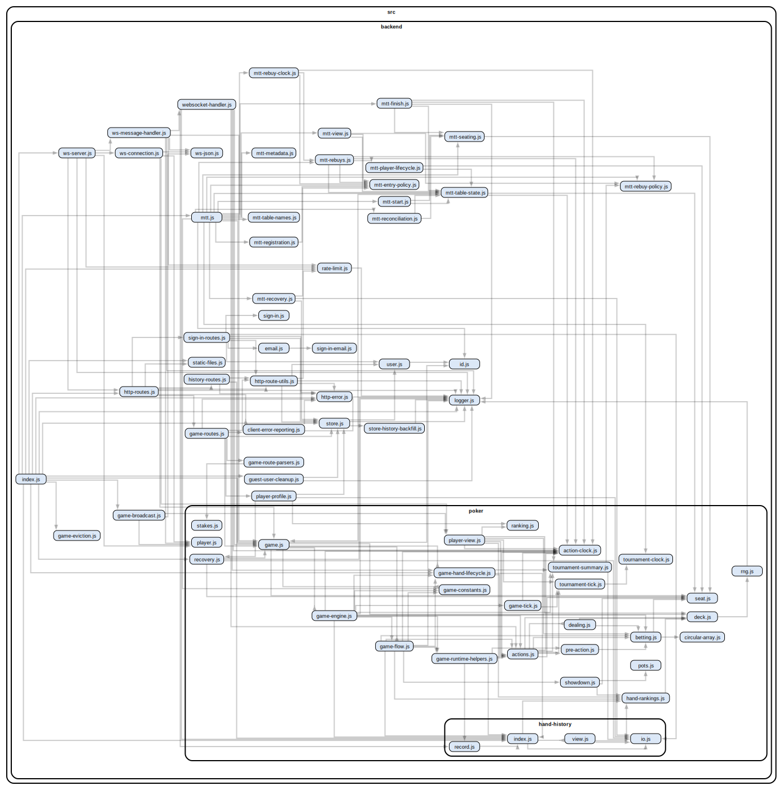
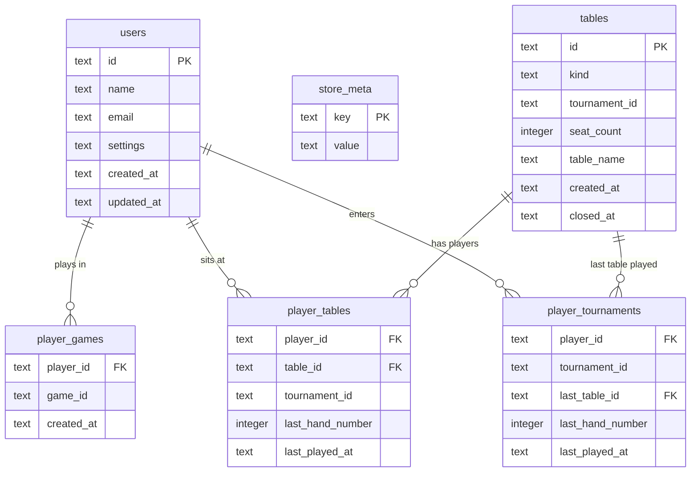

# Backend

## Dependency Graph



## Project Structure

```
src/backend/
├── index.js                  # HTTP + WebSocket server entry
├── http-routes.js            # HTTP route handlers
├── websocket-handler.js      # WebSocket message handling
├── ws-server.js              # WebSocket server and message routing
├── static-files.js           # Static file serving
├── logger.js                 # Logging utilities
├── store.js                  # SQLite database, session and history management
├── store-history-backfill.js # Migrate legacy .ohh files to DB indices
├── user.js                   # User identity and creation
├── id.js                     # ID generation utilities
├── http-error.js             # Structured HTTP error class
├── rate-limit.js             # Rate limiting
├── game-eviction.js          # Player eviction/timeout logic
├── game-broadcast.js         # Broadcasting game/tournament state to clients
├── game-route-parsers.js     # Route parsing for cash/sitngo/mtt URLs
├── mtt.js                    # Multi-table tournament lifecycle and table management
├── player-profile.js         # Public player profile stats and history aggregation
├── sign-in.js                # Passwordless sign-in token generation and validation
├── sign-in-routes.js         # HTTP API routes for sign-in flow
├── sign-in-email.js          # HTML + plain text sign-in email template
├── email.js                  # AWS SES client with local file-sink fallback
├── client-error-reporting.js # Frontend error logging endpoint
└── poker/                    # Game logic (pure functions)
    ├── game.js               # Game state initialization
    ├── game-tick.js          # Game tick orchestration
    ├── actions.js            # Game actions (generators)
    ├── betting.js            # Betting logic and turn management
    ├── dealing.js            # Card dealing logic
    ├── hand-rankings.js      # Hand evaluation & comparison
    ├── hand-history/         # Hand history (OHH spec: https://hh-specs.handhistory.org/)
    │   ├── index.js          # History generation
    │   ├── io.js             # File I/O operations
    │   └── view.js           # History view formatting
    ├── player.js             # Player identity
    ├── player-view.js        # Server-side view filtering
    ├── pots.js               # Pot calculation and side pots
    ├── ranking.js            # Hand ranking utilities
    ├── recovery.js           # Game state recovery from hand history
    ├── seat.js               # Seat representation
    ├── showdown.js           # Showdown logic
    ├── stakes.js             # Blind/ante configuration
    ├── tournament-summary.js # Tournament summary (OTS spec: https://ts-specs.handhistory.org/)
    ├── tournament-tick.js    # Tournament blind level progression
    ├── deck.js               # Card deck management
    ├── rng.js                # Random number generation
    ├── types.js              # TypeScript type definitions
    └── circular-array.js

src/shared/                   # Code shared between frontend and backend
├── stakes.js                 # Chip denominations and stake presets
├── tournament.js             # Tournament configuration constants (blind levels, buy-ins)
└── routes.js                 # Route matchers for cash/sitngo/mtt URLs
```

## Database

SQLite in WAL mode, stored at `/app/data/poker.db`. Accessed via Node.js `node:sqlite`.

### Entity Relationship Diagram



> **Note**: Tournaments are managed in-memory by `mtt.js` — there is no `tournaments` table. The `tournament_id` column on `tables`, `player_tables`, and `player_tournaments` is an opaque ID linking rows that belong to the same MTT.

### Tables

| Table                | Purpose                                                      |
| -------------------- | ------------------------------------------------------------ |
| `users`              | Registered player accounts (name, email, settings JSON)      |
| `store_meta`         | Internal metadata (e.g. backfill tracking)                   |
| `player_games`       | Records which players participated in each game              |
| `tables`             | Cash/SNG/MTT table records; `kind` ∈ `cash`, `sitngo`, `mtt` |
| `player_tables`      | Player activity per table (last hand, last played timestamp) |
| `player_tournaments` | Player participation per MTT (last table, last hand)         |

## Authentication

Passwordless email-based sign-in via one-time tokens.

### Sign-In Flow

1. Guest session is created on first visit — a UUID is stored in the `phg` cookie
2. User submits their email → `POST /api/sign-in-links` generates a 32-byte base64url token (30-min TTL) and sends it via AWS SES
3. User clicks the link → browser navigates to `/auth/email-sign-in/callback?token=...`
4. Client calls `POST /api/sign-in-links/verify` — token is consumed (one-time use)
5. `completeSignIn()` merges the guest session into the registered account:
   - Rewrites player IDs in hand history files
   - Migrates `player_games` and `player_tables` DB records
   - Updates all live game seats (guest UUID → registered ID)
   - Migrates active WebSocket connections
   - Deletes the guest user record
6. Session cookie (`phg`) is updated with the registered user ID

### User Shape

```javascript
{
  id: string,          // UUID
  name: string | undefined,
  email: string | undefined,
  settings: { volume: number }
}
```

## Player Profiles

`GET /api/players/:playerId` returns a public profile aggregated from the database and hand history files:

```javascript
{
  id: string,
  name: string,
  online: boolean,
  lastSeenAt: string | null,
  joinedAt: string,
  totalNetWinnings: number,   // cents
  totalHands: number,
  recentGames: [{
    gameId, tableId, tournamentId,
    gameType, netWinnings, handsPlayed,
    lastPlayedAt, lastHandNumber
  }]
}
```

## Multi-Table Tournaments

`mtt.js` manages the full lifecycle of MTTs entirely in-memory. Persistence is handled by the database tables above.

### Tournament Lifecycle

1. **Registration** — Owner creates tournament; players join via `registerPlayer()`
2. **Start** — Owner calls `startTournament()`; initial tables are created and seating is assigned
3. **Running** — Blind levels escalate every 15 minutes; a 5-minute break follows level 4
4. **Rebalancing** — After each hand finalizes, `handleHandFinalized()` eliminates busted players, collapses near-empty tables, and redistributes players
5. **Finish** — Last player standing is marked winner

### Blind Schedule

| Level   | Small / Big | Ante  |
| ------- | ----------- | ----- |
| 1       | 25 / 50     | —     |
| 2       | 50 / 100    | —     |
| 3       | 100 / 200   | —     |
| 4       | 150 / 300   | —     |
| _Break_ | —           | 5 min |
| 5       | 200 / 400   | —     |
| 6       | 300 / 600   | —     |
| 7       | 500 / 1000  | —     |

### Tournament Entrant Shape

```javascript
{
  playerId: string,
  name: string,
  status: "registered" | "seated" | "eliminated" | "winner",
  stack: number,              // cents
  tableId: string | null,
  seatIndex: number | null,
  finishPosition: number | null,
  handsPlayed: number,
  registrationOrder: number,
  registeredAt: string,
  eliminatedAt: string | null
}
```

## Communication Model

### WebSocket Protocol

Messages are JSON objects with an `action` field:

```javascript
// Client → Server
{ "action": "sit", "seat": 2 }
{ "action": "buyIn", "amount": 50 }
{ "action": "register" }       // MTT registration
{ "action": "start" }          // MTT start (owner only)

// Server → Client (game state every 200ms)
{ "seats": [...], "board": {...}, ... }

// Server → Client (tournament state every 1000ms)
{ "id": "...", "status": "running", "entrants": [...], ... }
```

**Connection header** carries the authenticated user context:

```javascript
{ user: User, gameId: Id | null, tournamentId: Id | null }
```

### Data Flow

1. Client sends action via WebSocket
2. Server executes action, mutating game state
3. Server generates player-specific view (hides opponent cards, shows available actions)
4. Server broadcasts updated state to all connected players

### Broadcast Types

| Type              | Interval | Description                         |
| ----------------- | -------- | ----------------------------------- |
| `gameState`       | 200 ms   | Per-player filtered game view       |
| `tournamentState` | 1000 ms  | Tournament standings and table list |
| `history`         | on event | Hand finalized notification         |
| `social`          | on event | Chat/emote messages                 |

### Player Views

Each player receives a filtered view of the game state:

- Their own cards are visible
- Opponent cards are hidden
- Available actions are computed per-seat

## Game State

```javascript
{
  running: boolean,
  button: number,          // Dealer position
  blinds: { ante, small, big },
  seats: Seat[],           // Configurable: 2 (heads-up), 6 (6-max), 9 (full ring)
  deck: Card[],
  board: { cards: Card[] }
}
```

### Seat States

```javascript
// Empty
{
  empty: true;
}

// Occupied
{
  empty: (false, player, cards, stack, bet, actions);
}
```

## Patterns

### Generator-Based Actions

Complex multi-step actions use generators for pausable execution:

```javascript
export function* dealPreflop(game) {
  for (const seat of occupiedSeats(game)) {
    seat.cards.push(deal(game.deck));
    yield; // Pause between cards
  }
}
```

### Circular Iteration

Seats are arranged in a circle; use modulo for wraparound:

```javascript
const nextIndex = (i) => (i + 1) % seats.length;
```

### Pure Game Logic

Poker logic in `src/backend/poker/` is pure and testable:

- No I/O or side effects
- Takes game state, returns/mutates state
- Easily unit tested

## Logging

Uses canonical log lines — one structured log per lifecycle, emitted at the end with all accumulated context.

A `Log` is a plain data object `{ level, message, timestamp, context }` created via `createLog()`. Context is accumulated throughout the lifecycle and the log is emitted once via `emitLog()`, which adds `durationMs` automatically.

| Message          | Scope                       | Created                | Emitted          |
| ---------------- | --------------------------- | ---------------------- | ---------------- |
| `http_request`   | One per HTTP request        | `server.on("request")` | `finally` block  |
| `ws_action`      | One per WebSocket message   | `ws.on("message")`     | `finally` block  |
| `hand`           | One per poker hand          | `startHand()`          | `logHandEnded()` |
| `eviction_sweep` | One per eviction timer tick | `evictInactiveGames()` | After sweep loop |

One-shot logs that don't benefit from accumulation use `logger.info()` / `logger.warn()` directly: WebSocket connect/disconnect, shutdown, DB init, recovery warnings, rate limit stats.

## Hand History

Hand histories and tournament summaries are stored using open standard formats:

- **[Open Hand History (OHH)](https://hh-specs.handhistory.org/)** — Used for individual hand records (`src/backend/poker/hand-history/`)
- **[Open Tournament Summary (OTS)](https://ts-specs.handhistory.org/)** — Used for tournament summaries (`src/backend/poker/tournament-summary.js`)

## Currency Convention

- All monetary values are stored as **integers in cents** to avoid floating-point precision issues
- The `Cents` type alias (`@typedef {number} Cents` in `types.js`) is used throughout to make this explicit
- Conversion to display format (e.g., `"$1.50"`) happens only at the UI layer via `formatCurrency()`

## Testing

Backend tests live in `test/backend/poker/` and mirror the source structure.

- Use `node:test` and `node:assert`
- Test generators by calling `.next()` explicitly
- Deep equality for object comparisons

```bash
npm run test:backend   # Run backend unit tests
```
