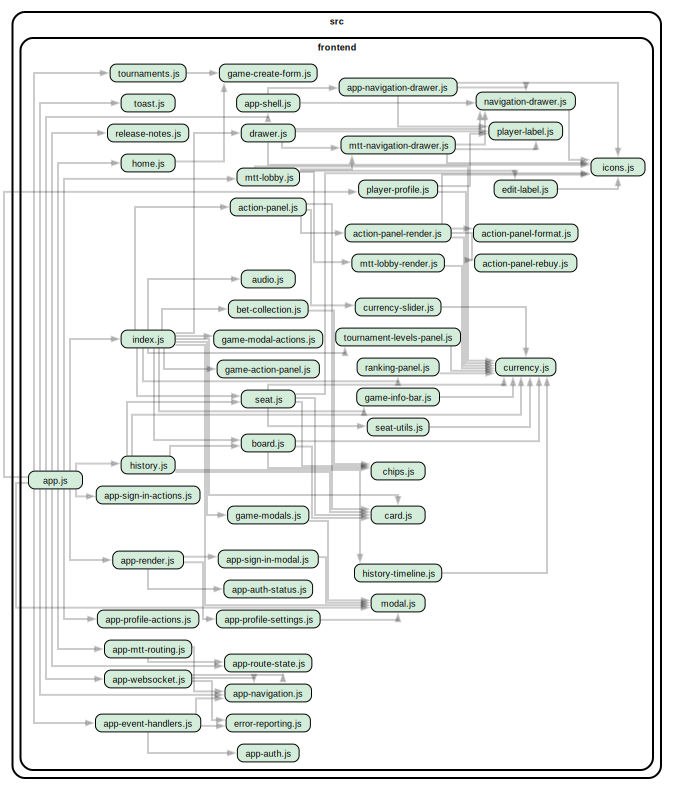

# Frontend

## Dependency Graph



## Project Structure

```
src/frontend/
├── index.html                 # Entry point with importmap
├── base.css                   # Shared base styles (font, body reset)
├── manifest.json              # PWA manifest
├── release-notes.html         # Release notes page
├── app.js                     # Main app router
├── app-shell.js               # App shell (top-level chrome, header, nav)
├── app-render.js              # App-level render helpers
├── app-route-state.js         # Route state management
├── app-event-handlers.js      # App-level event handling
├── app-modal-styles.js        # Shared modal styles
├── app-auth.js                # Auth state management (guest → registered flow)
├── app-auth-status.js         # Auth status indicator
├── app-sign-in-modal.js       # Passwordless email sign-in form
├── app-profile-settings.js    # User profile and settings panel
├── app-navigation-drawer.js   # Navigation drawer with tournament list
├── navigation-drawer.js       # Sliding drawer container component
├── drawer.js                  # Base drawer primitive
├── mtt-lobby.js               # Multi-table tournament lobby
├── player-profile.js          # Public player profile view
├── player-label.js            # Player name label component
├── game-modals.js             # Create cash / SNG / MTT game modals
├── game-modal-actions.js      # Game modal action handlers
├── index.js                   # Game table component
├── game-layout.js             # Game table layout positioning
├── game.styles.js             # Game view styles
├── action-panel.js            # Betting action buttons (fold/call/raise)
├── action-panel-render.js     # Action panel render helpers
├── action-panel-local.styles.js # Action panel local styles
├── board.js                   # Community cards display
├── seat.js                    # Player seat with stack and cards
├── seat-utils.js              # Seat utility functions
├── seat.styles.js             # Seat styles
├── card.js                    # Single playing card component
├── chips.js                   # Chip stack visualization
├── bet-collection.js          # Animated bet gathering
├── currency-slider.js         # Slider for selecting bet amounts
├── ranking-panel.js           # Hand rankings reference panel
├── history.js                 # Hand history viewer
├── history-styles.js          # History page styles
├── home.js                    # Landing page
├── release-notes.js           # Release notes component
├── icons.js                   # SVG icon definitions
├── button.js                  # Reusable button component
├── modal.js                   # Dialog overlay
├── toast.js                   # Notification popups
├── audio.js                   # Sound effect management
├── error-reporting.js         # Client-side error reporting to backend
└── styles.js                  # Design tokens and shared styles
```

## Development Workflow

- Lit installed via npm, served from `node_modules` via importmap (no bundler)
- Environment variables injected at serve time via stream transform
- Hot reload via browser refresh (backend has `--watch`)

## Components

### App Shell & Auth

| Component         | File                                 | Description                      |
| ----------------- | ------------------------------------ | -------------------------------- |
| App Router        | `app.js`                             | Top-level routing between pages  |
| App Shell         | `app-shell.js`                       | Header, navigation chrome        |
| Auth State        | `app-auth.js`                        | Guest → registered session merge |
| Auth Status       | `app-auth-status.js`                 | Signed-in / guest indicator      |
| Sign-In Modal     | `app-sign-in-modal.js`               | Passwordless email sign-in form  |
| Profile Settings  | `app-profile-settings.js`            | User name, settings panel        |
| Navigation Drawer | `app-navigation-drawer.js`           | Drawer with tournament list      |
| Drawer            | `navigation-drawer.js` / `drawer.js` | Sliding drawer container         |

### Tournaments & Profiles

| Component      | File                | Description                                    |
| -------------- | ------------------- | ---------------------------------------------- |
| MTT Lobby      | `mtt-lobby.js`      | Tournament registration, standings, table list |
| Player Profile | `player-profile.js` | Public player stats and recent games           |
| Player Label   | `player-label.js`   | Inline player name chip                        |
| Game Modals    | `game-modals.js`    | Create cash / SNG / MTT dialogs                |

### Game Table

| Component       | File                 | Description                         |
| --------------- | -------------------- | ----------------------------------- |
| Game Table      | `index.js`           | Main game view, orchestrates layout |
| Game Layout     | `game-layout.js`     | Table layout positioning            |
| Action Panel    | `action-panel.js`    | Fold / Call / Raise buttons         |
| Board           | `board.js`           | Community cards display             |
| Seat            | `seat.js`            | Player seat with stack and cards    |
| Card            | `card.js`            | Single playing card                 |
| Chips           | `chips.js`           | Chip stack visualization            |
| Bet Collection  | `bet-collection.js`  | Animated bet gathering              |
| Currency Slider | `currency-slider.js` | Slider for selecting bet amounts    |
| Ranking Panel   | `ranking-panel.js`   | Hand rankings reference             |

### Shared UI

| Component       | File                 | Description                     |
| --------------- | -------------------- | ------------------------------- |
| Hand History    | `history.js`         | Past hands viewer               |
| Home            | `home.js`            | Landing page                    |
| Icons           | `icons.js`           | SVG icon library                |
| Button          | `button.js`          | Reusable button component       |
| Modal           | `modal.js`           | Dialog overlay                  |
| Toast           | `toast.js`           | Notification popups             |
| Audio           | `audio.js`           | Sound effect management         |
| Styles / Tokens | `styles.js`          | Design tokens and shared styles |
| Error Reporting | `error-reporting.js` | Reports JS errors to backend    |

## Testing

### Unit Tests

Frontend component tests live in `test/frontend/` and use `@open-wc/testing` with `web-test-runner`.

```bash
npm run test:frontend   # Run frontend component tests
```

### UI Catalog

Visual regression testing with Playwright screenshots. Test cases live in `test/ui-catalog/test-cases/` and snapshots are stored in Git LFS.

```bash
npm run test:ui-catalog          # Run visual regression tests
npm run test:ui-catalog:update   # Regenerate snapshots after UI changes
```
