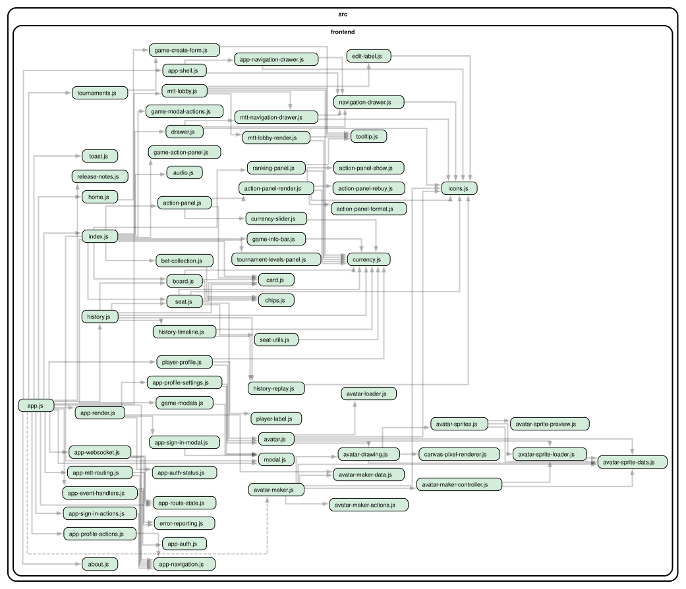

# Frontend

## Dependency Graph



## Key Files and Modules

```
src/frontend/
├── index.html                  # Entry point and import map
├── base.css                    # Design tokens and global reset
├── app.css                     # Shared stylesheet entry point
├── app.js                      # Top-level application state and router
├── app-shell.js                # Application chrome and navigation layout
├── app-render.js               # Page and app-level modal rendering
├── app-route-state.js          # Path parsing and page-specific route state
├── app-navigation.js           # History and URL-backed modal navigation
├── app-event-handlers.js       # App-level DOM event wiring
├── app-profile-actions.js      # Settings and avatar-draft actions
├── app-profile-settings.js     # Shared profile settings modal
├── app-sign-in-modal.js        # Shared sign-in/sign-up modal
├── app-navigation-drawer.js    # Site navigation and account actions
├── mtt-lobby.js                # Multi-table tournament lobby
├── mtt-lobby-render.js         # Lobby rendering helpers
├── player-profile.js           # Public profile, avatar, and game history
├── index.js                    # Live poker table component
├── game-layout.js              # Table layout positioning
├── action-panel.js             # Betting action state
├── action-panel-render.js      # Betting action rendering
├── seat.js                     # Player seat, avatar, stack, and cards
├── history.js                  # Hand history viewer
├── avatar-maker.js             # Dedicated avatar editor page
├── avatar.js                   # Reusable avatar renderer
├── avatar-loader.js            # Public avatar loading and revision cache
├── avatar-sprite-loader.js     # Selective runtime sprite loading
├── avatar-drawing.js           # Canvas rendering entry point
├── avatar-sprites.js           # Sprite composition and color transforms
├── avatar-sprite-data.js       # Sprite source and layer mappings
├── assets/avatar/              # Exported runtime sprite PNGs
└── styles/                     # Component and page stylesheets
```

## Development Workflow

- Lit installed via npm, served from `node_modules` via importmap (no bundler)
- Environment variables injected at serve time via stream transform
- Hot reload via browser refresh (backend has `--watch`)

## Components

### App Shell & Auth

| Component         | File                                 | Description                                  |
| ----------------- | ------------------------------------ | -------------------------------------------- |
| App Router        | `app.js` / `app-route-state.js`      | Top-level page and live-resource routing     |
| App Navigation    | `app-navigation.js`                  | Browser history and URL-backed modal state   |
| App Shell         | `app-shell.js`                       | Header and navigation chrome                 |
| Auth State        | `app-auth.js`                        | Guest → registered session merge             |
| Auth Status       | `app-auth-status.js`                 | Signed-in / guest indicator                  |
| Sign-In Modal     | `app-sign-in-modal.js`               | Shared passwordless sign-in and sign-up form |
| Profile Settings  | `app-profile-settings.js`            | Name, avatar, sound, and vibration settings  |
| Navigation Drawer | `app-navigation-drawer.js`           | Site navigation and profile actions          |
| Drawer            | `navigation-drawer.js` / `drawer.js` | Sliding drawer container                     |

### Tournaments & Profiles

| Component      | File                | Description                                    |
| -------------- | ------------------- | ---------------------------------------------- |
| MTT Lobby      | `mtt-lobby.js`      | Tournament registration, standings, table list |
| Player Profile | `player-profile.js` | Public avatar, player stats, and recent games  |
| Player Label   | `player-label.js`   | Consistent player name formatting              |
| Game Modals    | `game-modals.js`    | Create cash / Sit & Go / MTT dialogs           |

### Game Table

| Component       | File                 | Description                         |
| --------------- | -------------------- | ----------------------------------- |
| Game Table      | `index.js`           | Main game view, orchestrates layout |
| Game Layout     | `game-layout.js`     | Table layout positioning            |
| Action Panel    | `action-panel.js`    | Fold / Call / Raise buttons         |
| Board           | `board.js`           | Community cards display             |
| Seat            | `seat.js`            | Player seat with stack and cards    |
| Card            | `card.js`            | Single playing card                 |
| Chips           | `chips.js`           | Chip stack visualization            |
| Bet Collection  | `bet-collection.js`  | Animated bet gathering              |
| Currency Slider | `currency-slider.js` | Slider for selecting bet amounts    |
| Ranking Panel   | `ranking-panel.js`   | Hand rankings reference             |

### Shared UI

| Component       | File                 | Description                               |
| --------------- | -------------------- | ----------------------------------------- |
| Hand History    | `history.js`         | Past hands viewer                         |
| Avatar Maker    | `avatar-maker.js`    | Responsive avatar customization page      |
| Avatar          | `avatar.js`          | Local and revision-backed canvas renderer |
| Home            | `home.js`            | Landing page                              |
| Icons           | `icons.js`           | SVG icon library                          |
| Modal           | `modal.js`           | Dialog overlay                            |
| Toast           | `toast.js`           | Notification popups                       |
| Audio           | `audio.js`           | Sound effect management                   |
| Styles / Tokens | `base.css`           | Design tokens and shared global styles    |
| Error Reporting | `error-reporting.js` | Reports JavaScript errors to the backend  |

## Navigation and Modal State

`app-route-state.js` maps paths to pages and live resources. Internal links are
handled by `app-navigation.js`, which uses the Navigation API when available and
falls back to the History API.

Settings, sign-in, and sign-up are app-level modals represented by the `modal`
query parameter, for example `?modal=settings`. This gives dialogs normal back
button behavior and lets the avatar editor return to the existing Settings
draft. Both landing pages and live games use these same modal implementations.

## Avatar System

The avatar maker is a dedicated `/avatar` page. Tables and public profiles use
the reusable `<phg-avatar>` renderer, while Settings can preview a local draft.
See [Avatars](avatar.md) for the configuration schema, persistence model,
revision-based loading, rendering pipeline, and sprite export workflow.

## Testing

### Unit Tests

Frontend component tests live in `test/frontend/` and use `@open-wc/testing` with `web-test-runner`.

```bash
npm run test:frontend   # Run frontend component tests
```

### UI Catalog

Visual regression testing with Playwright screenshots. Test cases live in `test/ui-catalog/test-cases/` and snapshots are stored in Git LFS.

```bash
npm run test:ui-catalog          # Run visual regression tests
npm run test:ui-catalog:update   # Regenerate snapshots after UI changes
```
